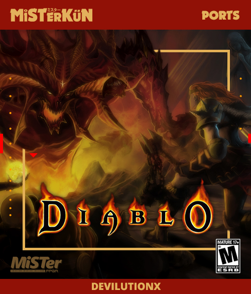

# MiSTer_DeViL - A DevilutionX (Diablo) Port for the MiSTer platform

**Traveler, stay awhile and listen...**

DevilutionX is a open-source re-implementation of Blizzard's Diablo game engine. Travelers looking for the authentic Diablo experience can play the game as it was in 1996, with period-appropriate 20 FPS SVGA graphics and the ability to play via network.



> **DISCLAIMER**: None of the Diablo 1 game assets are provided by this project. You'll need to provide your own `DIABDAT.MPQ` file. To get a legitimate copy of the file, you'll need the original Diablo game disc or the [GoG release of Diablo 1](https://www.gog.com/game/diablo).

## Purpose

This port was a side effect of some development research that I'm doing for another project on the MiSTer. 

The application is a self contained, no package or library need to be installed. Save games and config files are written inside the installation folder on the SD card, thus not impacting nor interfering in anyway with the Core Linux system.

> **NOTE**: While this port provides another platform to play Diablo, it's just an ARM application running on Linux and it doesn't really showcase the FGPA capabilities of the MiSTer.

## Installation

- Download and extract the contents of `Arm-DevilutionX_[VERSION].zip` [release](https://github.com/MiSTerKuN-io/MiSTer_DeViL/tree/master/releases) into the root of your SD Card.
- Optionally you can install from the terminal by running: 
```sh
wget -qO- https://github.com/misterkun-io/MiSTer_DeViL/raw/master/releases/Arm-DevilutionX_0.5.0.zip | bsdtar -xvf- -C /media/fat/
```
- Copy `DIABDAT.MPQ` from the original Diablo game disc or the [GOG version](https://www.gog.com/game/diablo) to the `Diablo` folder on your SD Card.

## How to Play

- Launch `Diablo` via the scripts menu.
- Enjoy :)

> The original Diablo manual can be found [here](http://ftp.blizzard.com/pub/misc/Diablo.PDF)

## Multiplayer

- **TCP/IP** only requires the host to expose port **6112**
- **UDP/IP** requires that all players expose port **6112**

> All games are encrypted and password protected.

## Notes

There are still quiet a few bugs. Check [issues on the code repo](https://github.com/diasurgical/devilution/issues).

## Source Code

[devilutionX](https://github.com/diasurgical/devilutionX) project on GitHub

## Credits

- MiSTer Port by [Boogermann](https://github.com/boogermann/) in 2019
- Cover artwork "[Final Showdown](https://www.deviantart.com/pixelcharlie/art/Final-Showdown-163342194)" by [pixelcharlie](https://www.deviantart.com/pixelcharlie)
- Reverse engineered by GalaXyHaXz in 2018
- [sanctuary](https://github.com/sanctuary) - extensively documenting Diablo's game engine
- [BWAPI Team](https://github.com/bwapi) - providing library API to work with Storm
- [Ladislav Zezula](https://github.com/ladislav-zezula) - reversing PKWARE library, further documenting Storm
- [fearedbliss](https://github.com/fearedbliss) - being awe-inspiring
- Climax Studios & Sony - secretly helping with their undercover QA :P
- Blizzard North - wait, this was a typo!
- Depression - reason to waste four months of my life doing this ;)

And a special thanks to all the support and people who work on Devilution to make it possible! <3

## Legal
**MiSTerKüN.io** and any of its' maintainers are in no way associated with or endorsed by Blizzard Entertainment(R).

**MiSTer** is an open source hardware reimplementation project designed to be used on an FPGA. It reimplements various console, arcade, and computer hardware on the Terasic DE10-nano development board as opposed to running projects like Lakka on an ARM-based DIY emulation box.

**Devilution** is released to the Public Domain. The documentation and function provided by Devilution may only be utilized with assets provided by ownership of Diablo.

**Battle.net**(R) - Copyright (C) 1996 Blizzard Entertainment, Inc. All rights reserved. Battle.net and Blizzard Entertainment are trademarks or registered trademarks of Blizzard Entertainment, Inc. in the U.S. and/or other countries.

**Diablo**(R) - Copyright (C) 1996 Blizzard Entertainment, Inc. All rights reserved. Diablo and Blizzard Entertainment are trademarks or registered trademarks of Blizzard Entertainment, Inc. in the U.S. and/or other countries.

**Devilution** and any of its' maintainers are in no way associated with or endorsed by Blizzard Entertainment(R).
